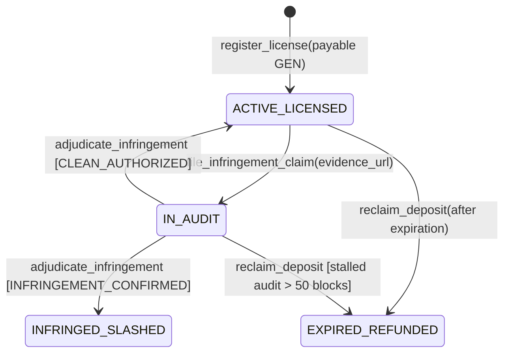

# Architecture & Protocol Design: ProofOfPrompt

## 1. Domain Problem: Prompt Theft & Unenforceable AI Licenses

In traditional web3 and EVM-compatible networks, intellectual property licensing relies on passive token transfers or off-chain legal contracts. A smart contract deployed on Ethereum or Solana has no perception of the external web; it cannot crawl a digital storefront, examine visual style markers, or detect prompt leakage.

**ProofOfPrompt** leverages GenLayer's **GenVM** to create an on-chain, autonomous intellectual property court that can:
1. Lock guarantee deposits natively in GEN tokens.
2. Read live public web evidence through `gl.nondet.web.render`.
3. Process unstructured natural language prompt specifications through multi-validator LLM execution.
4. Reach subjective democratic consensus on semantic verdicts without brittle schema-matching failures.

---

## 2. State Machine: LicenseVault Lifecycle



### State Definitions

| Status Code | Enum Name | Description |
|:---:|:---|:---|
| `0` | `ACTIVE_LICENSED` | Vault active. Licensee is permitted to generate outputs according to the terms. Escrow locked. |
| `1` | `IN_AUDIT` | Creator has detected unauthorized commercial use and filed evidence URL. Awaiting AI Jury trial. |
| `2` | `INFRINGED_SLASHED` | AI Jury confirmed copyright infringement. Guarantee deposit slashed and transferred to Creator. |
| `3` | `EXPIRED_REFUNDED` | Licensing term concluded with zero verified infringements. Guarantee deposit refunded to Licensee. |

---

## 3. Subjective Consensus Protocol

### The Leader & Validator Pattern

When `adjudicate_infringement(vault_id)` is invoked:
1. **Leader Execution:**
   - The consensus leader triggers `gl.nondet.web.render(evidence_url, mode="text")`.
   - The leader submits the protected style DNA and the crawled text to `gl.nondet.exec_prompt(...)`.
   - The LLM outputs a structured evaluation payload containing `verdict`, `confidence`, `similarity_score`, and `reason`.
2. **Validator Verification:**
   - Other validators independently execute their own web scrape and LLM inference.
   - The `validator_fn` enforces **Semantic Equivalence**:
     ```python
     def validator_fn(leader_res) -> bool:
         if not isinstance(leader_res, gl.vm.Return):
             return False
         mine = leader_fn()
         # Semantic Consensus: Compare VERDICT ONLY!
         return mine["verdict"] == leader["verdict"]
     ```
   - By comparing solely the categorical verdict (`INFRINGEMENT_CONFIRMED` vs `CLEAN_AUTHORIZED`), validators reach solid consensus even if individual LLM instances generate slight wording differences in their qualitative explanations.

---

## 4. Economic Security & Liquidated Damages

- **Bond Collateral:** The Licensee posts collateral proportional to the commercial value of the licensed style DNA.
- **Immediate Slashing:** If infringement is verified, `gl.get_contract_at(v.creator).emit_transfer(value=u256(deposit_val))` routes the locked GEN directly to the victim creator.
- **Zero Centralized Oracles:** Eliminates intermediary arbitration fees or delayed human court proceedings.
