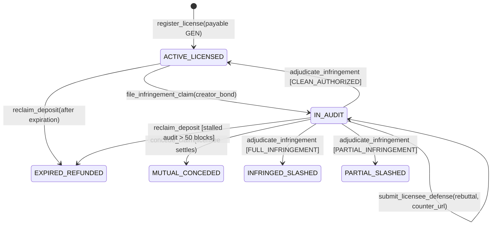

# Architecture & Protocol Design: ProofOfPrompt

## 1. Domain Problem: Prompt Theft & Unenforceable AI Licenses

In traditional web3 and EVM-compatible networks, intellectual property licensing relies on passive token transfers or off-chain legal contracts. A smart contract deployed on Ethereum or Solana has no perception of the external web; it cannot crawl a digital storefront, examine visual style markers, or detect prompt leakage.

**ProofOfPrompt** leverages GenLayer's **GenVM** to create an on-chain, autonomous intellectual property court that can:
1. Lock guarantee deposits natively in GEN tokens.
2. Read live public web evidence through `gl.nondet.web.render`.
3. Process unstructured natural language prompt specifications through multi-validator LLM execution.
4. Reach subjective democratic consensus on semantic verdicts without brittle schema-matching failures.

---

## 2. State Machine: LicenseVault Lifecycle



### State Definitions

| Status Code | Enum Name | Description |
|:---:|:---|:---|
| `0` | `ACTIVE_LICENSED` | Vault active. Licensee is permitted to generate outputs according to the terms. Escrow locked. |
| `1` | `IN_AUDIT` | Creator filed dispute with anti-harassment bond. Licensee can file rebuttal before AI trial. |
| `2` | `INFRINGED_SLASHED` | AI Jury confirmed full copyright piracy. 100% deposit slashed to Creator; creator bond refunded. |
| `3` | `EXPIRED_REFUNDED` | Licensing term concluded with zero verified infringements. Guarantee deposit refunded to Licensee. |
| `4` | `PARTIAL_SLASHED` | AI Jury confirmed partial derivative infringement. 50% deposit slashed to Creator, 50% retained by Licensee. |
| `5` | `MUTUAL_CONCEDED` | Licensee amicably conceded the dispute without contest. Deposit slashed to Creator, bond returned. |

---

## 3. Subjective Consensus Protocol

### The Leader & Validator Pattern

When `adjudicate_infringement(vault_id)` is invoked:
1. **Leader Execution:**
   - The consensus leader triggers `gl.nondet.web.render(evidence_url, mode="text")`.
   - The leader submits the protected style DNA and the crawled text to `gl.nondet.exec_prompt(...)`.
   - The LLM outputs a structured evaluation payload containing `verdict`, `confidence`, `similarity_score`, and `reason`.
2. **Validator Verification:**
   - Other validators independently execute their own web scrape and LLM inference.
   - The `validator_fn` enforces **Semantic Equivalence**:
     ```python
     def validator_fn(leader_res) -> bool:
         if not isinstance(leader_res, gl.vm.Return):
             return False
         mine = leader_fn()
         # Semantic Consensus: Compare VERDICT ONLY!
         return mine["verdict"] == leader["verdict"]
     ```
   - By comparing solely the categorical verdict (`INFRINGEMENT_CONFIRMED` vs `CLEAN_AUTHORIZED`), validators reach solid consensus even if individual LLM instances generate slight wording differences in their qualitative explanations.

---

## 4. Two-Sided Economic Security & Dispute Balance

- **Licensee Guarantee Escrow:** The Licensee posts collateral proportional to the commercial value of the licensed style DNA.
- **Creator Anti-Harassment Dispute Bond:** To discourage bad-faith or frivolous copyright claims intended to harass licensees, creators must stake a deposit bond (default: 10% of escrow, min 0.05 GEN) when filing a dispute.
  - If the AI Jury confirms infringement (`FULL_INFRINGEMENT` or `PARTIAL_INFRINGEMENT`), the bond is refunded in full to the creator.
  - If the claim is judged clean (`CLEAN_AUTHORIZED`), the bond is forfeited and awarded directly to the defendant licensee as compensation for harassment.
- **Licensee Right of Defense:** Licensees can present counter-arguments and proof of authorization (`submit_licensee_defense`). The validator prompt compares both sides before voting.
- **Graduated Slashing:** 
  - `FULL_INFRINGEMENT`: 100% licensee deposit slashed to Creator.
  - `PARTIAL_INFRINGEMENT`: 50% deposit slashed to Creator, 50% saved for Licensee.
- **Amicable Settlement:** Licensees can settle without trial via `concede_claim`, returning the creator's bond and transferring the deposit cleanly.
